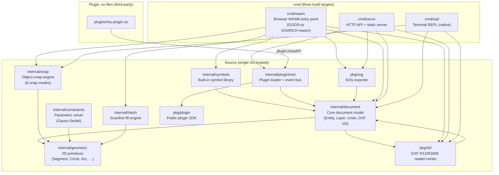
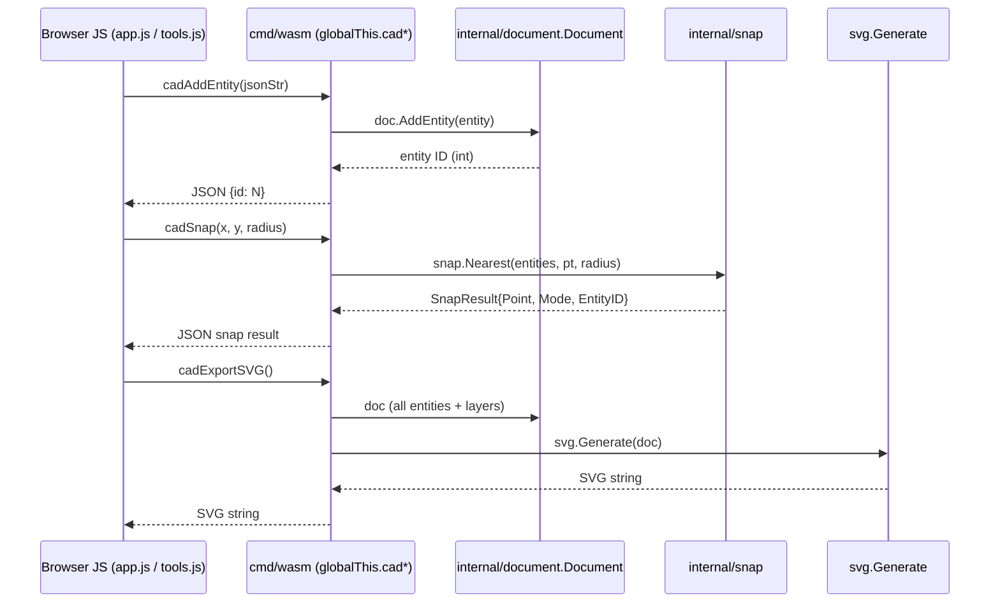
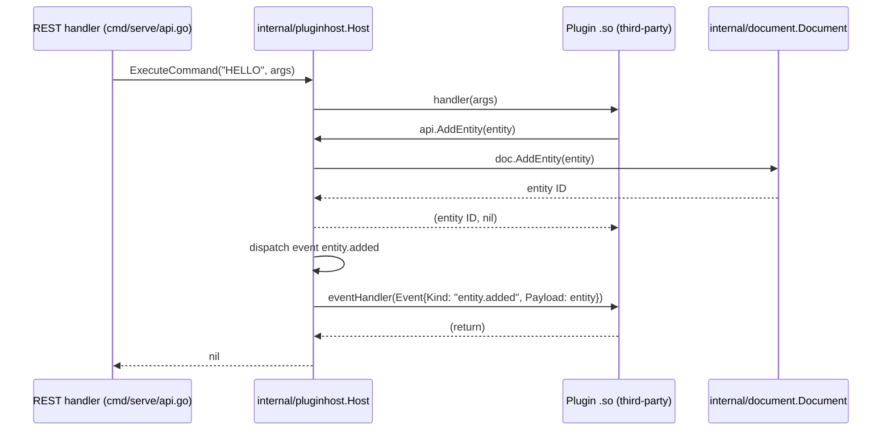
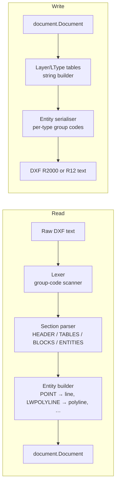
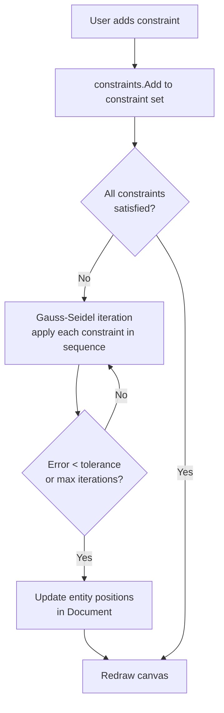
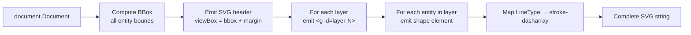
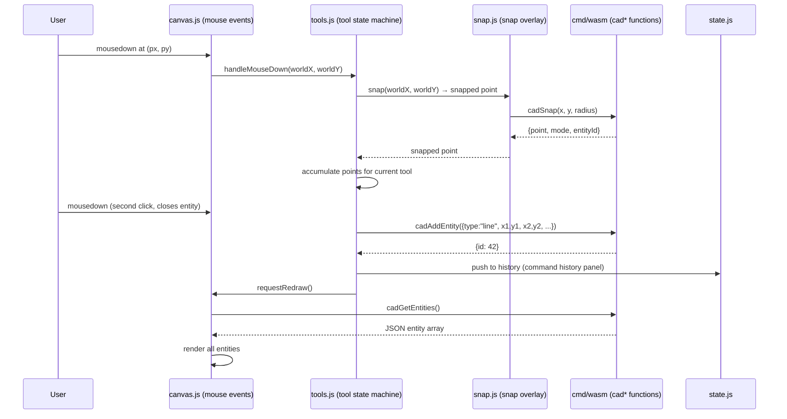

# go-cad Architecture

This document describes the internal architecture of go-cad, the major component boundaries, and the data flows between them.

---

## Overall component graph



---

## Compilation targets

go-cad is a **single Go module** (`module go-cad`, zero external imports) that compiles to three different targets:

| Target | Command | OS/Arch | Output |
|--------|---------|---------|--------|
| Browser | `cmd/wasm` | `GOOS=js GOARCH=wasm` | `web/main.wasm` |
| HTTP server | `cmd/serve` | any | `./cad-serve` binary |
| Terminal REPL | `cmd/cad` | any | `./cad` binary |

All three share `internal/document` as the single source of truth for the document model. The WASM target has an additional build constraint (`//go:build js`) so the `syscall/js` imports are invisible to the native builds.

---

## Core document model (`internal/document`)

The `Document` struct owns the complete drawing state:

```
Document
├── entities  []Entity          (append-only; deletions mark ID as free)
├── layers    []Layer           (index 0 = default layer "0")
├── blocks    map[string]Block  (named block definitions for INSERT)
├── history   []snapshot        (undo stack; each snapshot = full entity slice)
└── redo      []snapshot        (redo stack; cleared on any new mutation)
```

Every mutation (add, delete, update) pushes a snapshot before the change. Undo pops from `history`; redo pops from `redo`. Snapshots use copy-on-write slices, so most operations are O(n) in entity count.

### Entity struct

All entity types share a single flat `Entity` struct (discriminated by `Type` string). Fields are reused across types and are omitted from JSON when zero:

```
Entity { ID, Type, Layer, Color, X1, Y1, X2, Y2, CX, CY, R,
         StartAngle, EndAngle, Width, Height, Rotation,
         Points []Point, Text, Style,
         LineType, LineWeight,
         Children []Entity    ← for blocks/hatches
         ... }
```

This flat representation makes JSON serialization simple and avoids the overhead of interface dispatch in the hot render path.

---

## WASM bridge call flow

The browser frontend communicates with Go via functions exported to `globalThis`:



All bridge functions follow the same contract:
- Input: zero or one JSON string argument (parsed by the bridge)
- Output: JSON string or primitive (returned as `js.ValueOf`)
- Errors: returned as `{"error": "..."}` JSON strings; JS callers check for the `error` key

The bridge is entirely in `cmd/wasm/main.go` (gated `//go:build js`). It contains no business logic; it only unmarshals inputs, calls `internal/` packages, and marshals outputs.

---

## Plugin host and event dispatch



Key properties of the plugin host:
- Plugins are loaded at startup from a configurable `plugins/` directory (or via POST `/api/v1/plugins/load`)
- Each plugin runs in the same process (no sandbox); `.so` files must be compiled with the same Go toolchain
- Event dispatch is synchronous and happens inside a write lock; event handlers must not call back into the host to avoid deadlock
- `ErrCommandNotFound` is a typed sentinel so REST handlers can return 404 vs 500 correctly

---

## DXF read/write pipeline



The reader uses a single-pass scanner that emits `(groupCode, value)` pairs. Entity construction is table-driven: each entity type has a builder function that consumes the relevant group codes and produces a `document.Entity`.

The writer is the inverse: it iterates the entity slice and emits the correct group codes for each `Type` discriminator. DXF R12 omits group codes not supported by that version (e.g. R12 has no print flag in the layer table).

---

## Constraint solver loop



The solver operates on a set of `Constraint` objects, each of which references entity IDs and constraint-specific parameters (e.g. a target distance for `EqualLength`). Each iteration applies corrections directly to the entity's control points. The solver is not globally optimal (not a full Newton step) but converges quickly for typical CAD constraint sets.

---

## SVG export pipeline



SVG coordinates are the raw CAD world coordinates — there is no Y-axis flip. Tools that consume go-cad SVG (e.g. web browsers) render in screen coordinates where Y increases downward; since DXF/CAD also uses Y-up internally, the visual result is a vertical mirror of the DXF view. This is a known trade-off that avoids a coordinate transform on every point.

---

## Browser frontend module graph

```
web/index.html
└── app.js (main entry — imports all modules)
    ├── state.js          Shared mutable state (zoom, pan, tool, currentLayer…)
    ├── canvas.js         Render loop (requestAnimationFrame, hit-testing)
    ├── tools.js          Tool state machine (line, circle, arc, select, …)
    ├── commands.js       Command palette + keyboard shortcut dispatch
    ├── snap.js           Snap overlay rendering + cadSnap call
    ├── inspector.js      Properties panel (right panel)
    ├── history.js        Command history panel (bottom panel)
    ├── panels.js         Splitter drag, panel collapse, localStorage persist
    ├── dialogs.js        All modal dialogs (layers, drafting, print, welcome)
    ├── welcome.js        Welcome overlay + recent files
    └── wasm.js           WASM loader + cadInit bootstrap
```

All modules are native ES modules loaded via `<script type="module">`. There is no bundler, no transpiler, and no npm. The WASM binary is loaded once at startup; all subsequent JS↔Go calls are synchronous function calls on `globalThis`.

---

## Data flow: drawing an entity (browser)


